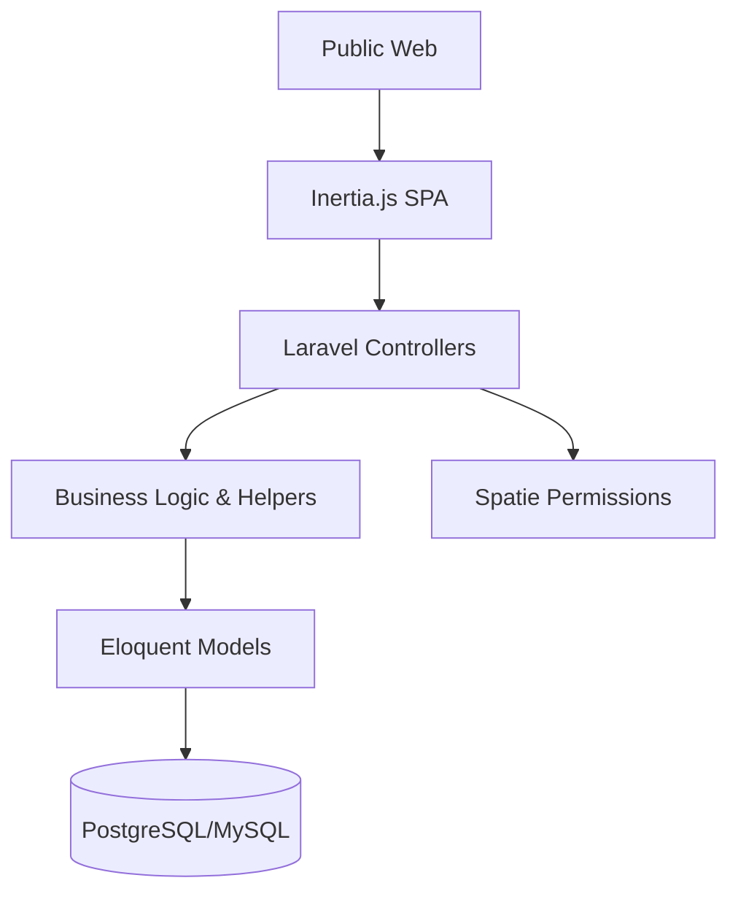

# 🚀 Labs Backend - Enterprise Management System (SaaS)

[](https://laravel.com)
[](https://vuejs.org)
[](https://inertiajs.com)
[](https://tailwindcss.com)

A premium, full-featured **Enterprise Resource Planning (ERP) and CRM solution** designed for digital agencies and freelancers. This system provides a centralized dashboard for managing projects, recurring maintenance services, client relationships, and team performance with advanced analytics.

---

## ✨ Key Features

- **📊 Advanced Analytics Dashboard**: Real-time KPIs tracking project profitability, Monthly Recurring Revenue (MRR), and resource allocation using ECharts.
- **💼 Comprehensive CRM**: Multi-faceted client profiles with detailed histories of projects, maintenance contracts, and communication logs.
- **🏗️ Project Lifecycle Management**: Granular control over project stages, from estimation and budgeting to final delivery and service tracking.
- **🔄 Recurring Service Automation**: Automated management of monthly and annual maintenance services, including automated profitability calculations.
- **🔌 Extension Ecosystem**: Centralized repository of tools and licenses used across different projects for optimized cost management.
- **🔐 Secure RBAC**: Fine-grained access control using Spatie's permission system (Admin, Coordinator, Viewer roles).
- **📥 Smart Data Import**: Bulk import system for legacy client data with automatic normalization.
- **🌓 Adaptive UI**: Fully responsive interface with built-in dark mode and high-performance Inertia.js-driven navigation.

---

## 🛠️ Technology Stack

| Layer | Technologies |
| :--- | :--- |
| **Backend** | Laravel 12, PHP 8.3, Eloquent ORM |
| **Frontend** | Vue 3 (Composition API), Inertia.js |
| **Styling** | Tailwind CSS, Headless UI |
| **Analytics** | Apache ECharts, Vue-ECharts |
| **Auth/Security** | Laravel Breeze, Spatie Permissions |
| **Automation** | Custom Composables, Debounced Search, Advanced Filtering |

---

## 🏗️ System Architecture

The application follows a clean-architecture approach, separating business logic from representation through custom Helpers and Vue Composables for maximum reusability.



---

## 🚀 Getting Started

### Prerequisites

- PHP 8.3+
- Node.js 20+
- Composer
- MySQL/MariaDB

### Installation

1. **Clone the repository**
   ```bash
   git clone git@github.com:tu-usuario-git/Labs-Backend-FrancisV.git
   cd Labs-Backend-FrancisV
   ```

2. **Install dependencies**
   ```bash
   composer install
   npm install
   ```

3. **Configure Environment**
   ```bash
   cp .env.example .env
   php artisan key:generate
   ```

4. **Run Migrations & Seeders**
   ```bash
   php artisan migrate --seed
   ```

5. **Start Development Server**
   ```bash
   npm run dev
   # In another terminal:
   php artisan serve
   ```

---

## 📄 License

This project is licensed under the MIT License - see the [LICENSE](LICENSE) file for details.

---

## 👨‍💻 Author

**Francis Valenzuela**
- GitHub: [@tu-usuario-git](https://github.com/tu-usuario-git)
- Web: [www.TU_DOMINIO](https://www.TU_DOMINIO)

---
> *This repository is part of my professional portfolio. Feel free to explore the codebase and reach out for collaborations!*
