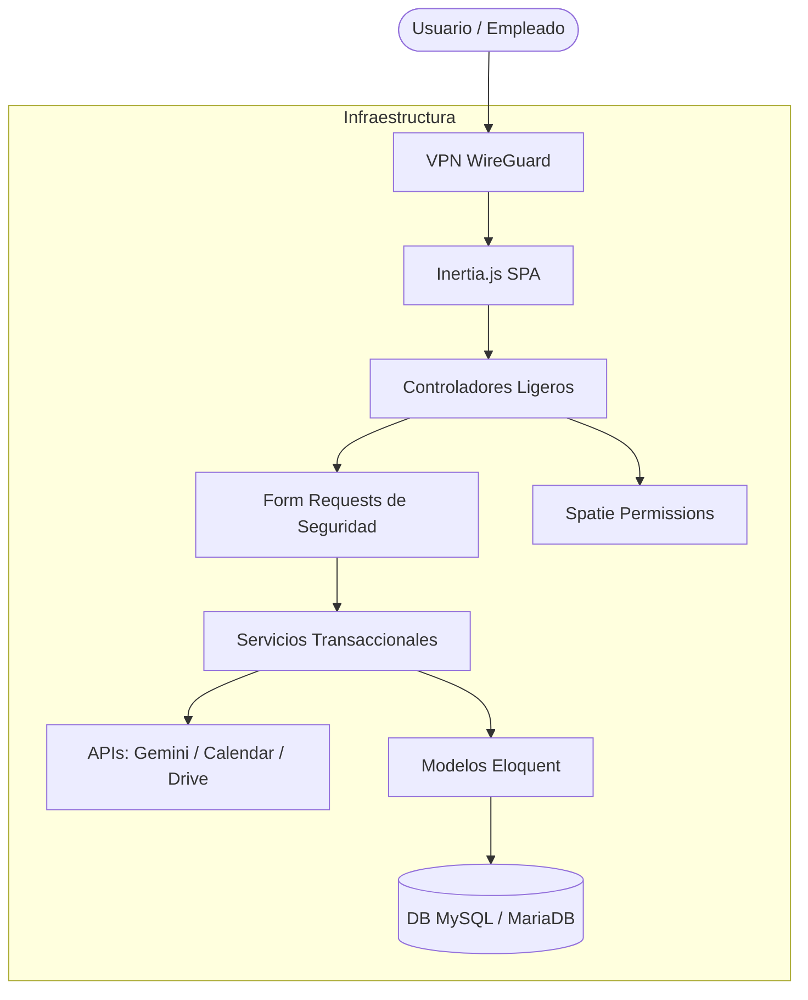

# 🚀 Labs Backend - Enterprise Management System

[English Version Below](#-labs-backend---enterprise-management-system-saas)

[](https://laravel.com)
[](https://vuejs.org)
[](https://inertiajs.com)
[](https://tailwindcss.com)

Una solución **ERP y CRM completa y premium**, diseñada para agencias digitales y freelancers. Este sistema proporciona un panel centralizado para gestionar proyectos, servicios de mantenimiento recurrentes, relaciones con clientes y rendimiento del equipo con analítica avanzada, bajo una **Arquitectura Limpia** altamente escalable.

---

## ✨ Funcionalidades Clave

- **🏗️ Arquitectura Limpia (Clean Architecture)**: Lógica de negocio 100% aislada en clases de Servicio transaccionales, Controladores ligeros y validación estricta vía FormRequests. Cero código espagueti.
- **🛡️ Alta Fiabilidad (75+ Tests Automatizados)**: Suite completa de pruebas unitarias y de integración que verifican la creación de facturas, cálculos de rentabilidad, envíos de emails y sincronizaciones VPN, garantizando cero regresiones.
- **💼 Ecosistema Nativo e Independiente**: Generación ultrarrápida al vuelo (sin estado) de Presupuestos y Facturas de Venta en PDF. Todo persiste en base de datos local y Google Drive, logrando independencia total de ERPs externos.
- **🤖 Inteligencia Artificial (Gemini AI)**: Sistema automatizado que escanea, clasifica y extrae datos financieros de las facturas de proveedores enviadas por PDF, almacenándolas de forma resiliente en Google Drive.
- **🔐 VPN Automatizada (WireGuard)**: Orquestador integrado que genera redes privadas, asigna IPs y distribuye llaves de conexión a los nuevos empleados automáticamente por email.
- **🔄 Sincronización Google Calendar**: Sincronización bidireccional silenciosa (vía Eloquent Observers) que enlaza el CRM local con tu calendario personal.
- **📊 Analítica y MRR en Tiempo Real**: Dashboards financieros y cuadros de mando creados con Apache ECharts, con cálculos automatizados de Ingresos Recurrentes Mensuales.
- **⚡ Rendimiento y Base de Datos**: Optimización extrema con Eager Loading (`with()`) para prevenir cuellos de botella N+1 y paginación en todos los recursos.
- **🌓 Interfaz Premium**: UI/UX responsive con modo oscuro integrado, creado con Vue 3 (Composition API) e Inertia.js para navegación ultrarrápida sin recargas de página.

---

## 🛠️ Stack Tecnológico

| Capa | Tecnologías |
| :--- | :--- |
| **Backend** | Laravel 13, PHP 8.4, Eloquent ORM |
| **Arquitectura** | Patrón de Servicios, FormRequests, Observers, Traits |
| **Frontend** | Vue 3 (Composition API), Inertia.js |
| **Estilo** | Tailwind CSS, Headless UI |
| **Automatización** | Google Gemini AI, Google Drive API, Google Calendar API |
| **Auth/Seguridad** | Laravel Breeze, Spatie Permissions, **WireGuard VPN** |
| **Testing** | Pest/PHPUnit (75+ Pruebas Automatizadas, Cobertura Integral) |

---

## 🏗️ Arquitectura del Sistema

La aplicación sigue un enfoque estricto de **Clean Architecture**, separando la base de datos de la lógica central para garantizar mantenibilidad a largo plazo.



---

## 🚀 Instalación

### Requisitos
- PHP 8.4+
- Node.js 20+
- Composer
- Base de datos relacional (MySQL/MariaDB)

### Pasos

1. **Clonar el repositorio**
   ```bash
   git clone git@github.com:tu-usuario-git/Labs-Backend-FrancisV.git
   cd Labs-Backend-FrancisV
   ```

2. **Instalar dependencias**
   ```bash
   composer install
   npm install
   ```

3. **Configurar Entorno**
   ```bash
   cp .env.example .env
   php artisan key:generate
   ```

4. **Ejecutar Migraciones y Seeders**
   ```bash
   php artisan migrate --seed
   ```

5. **Iniciar Servidor de Desarrollo**
   ```bash
   npm run dev
   php artisan serve
   ```

---

## 👨‍💻 Autor

**Francis Valenzuela**
- GitHub: [@tu-usuario-git](https://github.com/tu-usuario-git)
- Web: [www.TU_DOMINIO](https://www.TU_DOMINIO)

---

## 📄 Documentación Adicional

La documentación técnica completa ha sido unificada y actualizada:

- [Manual: Arquitectura, Lógica de Negocio y Testing](docs/logic_negocio.md)
- [Sistema de Facturas y Presupuestos (Ventas Nativas)](docs/gestion-facturas-ventas.md)
- [Sistema de Compras Inteligente (Gemini AI + Drive)](docs/gestion-facturas-compras.md)
- [Manual: Gestión de VPN WireGuard Segura](docs/VPN_DOCUMENTATION.md)
- [Integración con Google Calendar Automática](docs/integracion-google-calendar.md)

---

## ⚖️ Licencia

Este proyecto está bajo la licencia **GNU General Public License v3.0** - mira el archivo [LICENSE](LICENSE) para más detalles.

---

# 🚀 Labs Backend - Enterprise Management System (SaaS)

[](https://laravel.com)
[](https://vuejs.org)
[](https://inertiajs.com)
[](https://tailwindcss.com)

A premium, full-featured **Enterprise Resource Planning (ERP) and CRM solution** designed for digital agencies and freelancers. This system provides a centralized dashboard for managing projects, recurring maintenance services, and team performance, built entirely upon a highly scalable **Clean Architecture** model.

---

## ✨ Key Features

- **🏗️ Clean Architecture**: 100% decoupled business logic utilizing transactional Services, extremely thin Controllers, and strict FormRequests validation. Zero spaghetti code.
- **🛡️ Bulletproof Reliability (75+ Automated Tests)**: Comprehensive test suite guaranteeing stability across PDF rendering, financial calculations, VPN orchestration, and API integrations.
- **💼 Native & Independent Ecosystem**: Ultra-fast, stateless, on-the-fly PDF generation for Estimates and Invoices. The system relies purely on local database persistence, effectively eliminating dependencies on third-party ERPs like Holded.
- **🤖 Artificial Intelligence (Gemini AI)**: Smart ingestion system that scans, classifies, and extracts financial data from supplier invoices, securely archiving the original PDFs on Google Drive.
- **🔐 Automated VPN Provisioning (WireGuard)**: Integrated orchestrator that generates private network peers, assigns IPs, and emails secure configuration profiles to new employees upon creation.
- **🔄 Google Calendar Synchronization**: Silent, bidirectional background syncing (via Eloquent Observers) connecting the local CRM workflow to your personal calendar.
- **📊 Real-time Analytics & MRR**: Beautiful, interactive financial dashboards powered by Apache ECharts, computing Monthly Recurring Revenue instantaneously.
- **⚡ Extreme Optimization**: Total elimination of N+1 database queries through strategic eager loading, paired with paginated indexing for instantaneous UX.
- **🌓 Adaptive Premium UI**: A highly responsive, built-in dark mode interface crafted with Vue 3 and Inertia.js for seamless, SPA-like navigation.

---

## 🛠️ Technology Stack

| Layer | Technologies |
| :--- | :--- |
| **Backend** | Laravel 13, PHP 8.4, Eloquent ORM |
| **Architecture** | Service Pattern, FormRequests, Observers, Traits |
| **Frontend** | Vue 3 (Composition API), Inertia.js |
| **Styling** | Tailwind CSS, Headless UI |
| **Automation** | Google Gemini AI, Google Drive API, Google Calendar API |
| **Auth/Security** | Laravel Breeze, Spatie Permissions, **WireGuard VPN** |
| **Testing** | Pest/PHPUnit (75+ Automated Feature & Unit Tests) |

---

## 📄 Additional Documentation (Spanish)

- [Architecture & Business Logic Manual](docs/logic_negocio.md)
- [Native Sales Invoices & Estimates](docs/gestion-facturas-ventas.md)
- [Smart Purchases via Gemini AI](docs/gestion-facturas-compras.md)
- [WireGuard VPN Management](docs/VPN_DOCUMENTATION.md)
- [Google Calendar Integration](docs/integracion-google-calendar.md)

---
> *This repository is part of my professional portfolio. Feel free to explore the codebase and reach out for collaborations!*
