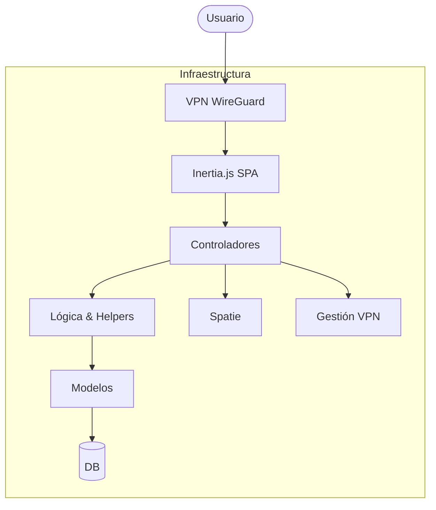
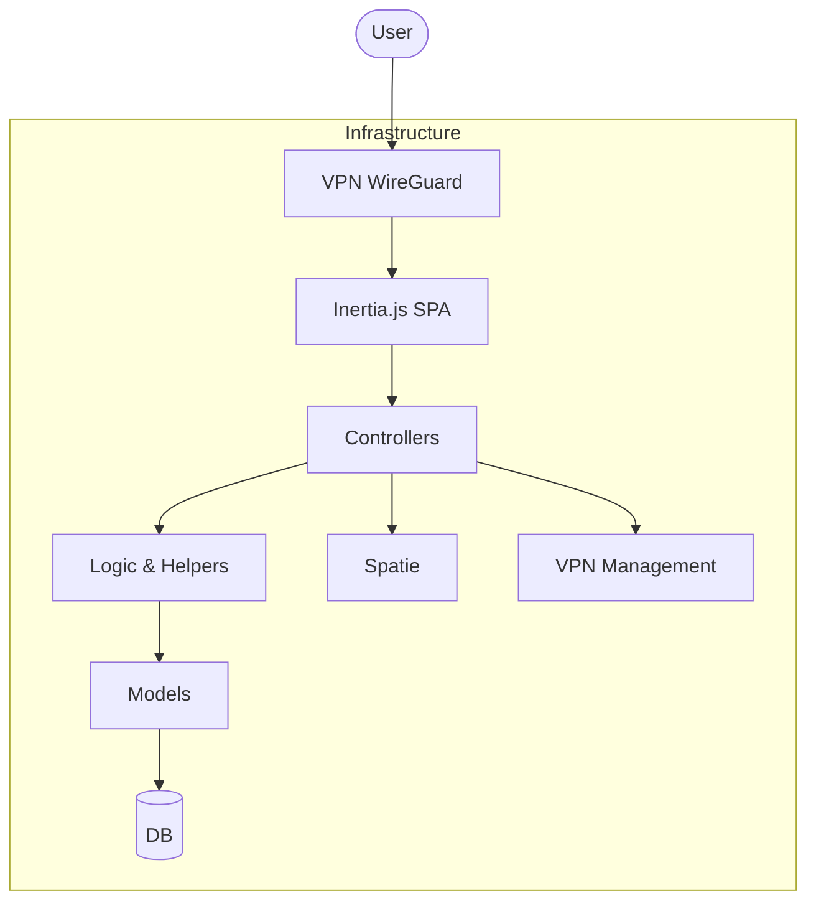

# 🚀 Labs Backend - Sistema de Gestión Empresarial

[English Version Below](#-labs-backend---enterprise-management-system-saas)

[](https://laravel.com)
[](https://vuejs.org)
[](https://inertiajs.com)
[](https://tailwindcss.com)

Una solución **ERP y CRM completa y premium**, diseñada para agencias digitales y freelancers. Este sistema proporciona un panel centralizado para gestionar proyectos, servicios de mantenimiento recurrentes, relaciones con clientes y rendimiento del equipo con analítica avanzada.

---

## ✨ Funcionalidades Clave

- **📊 Dashboard de Analítica Avanzada**: KPIs en tiempo real que rastrean la rentabilidad de proyectos, Ingresos Recurrentes Mensuales (MRR) y asignación de recursos usando ECharts.
- **💼 CRM Integral**: Perfiles de clientes multifacéticos con historiales detallados de proyectos, contratos de mantenimiento y registros de comunicación.
- **🏗️ Gestión del Ciclo de Vida de Proyectos**: Control granular sobre las etapas del proyecto, desde la estimación y presupuesto hasta la entrega final y seguimiento de tareas.
- **🔄 Automatización de Servicios Recurrentes**: Gestión automatizada de mantenimientos mensuales y anuales, incluyendo cálculos automáticos de rentabilidad.
- **🔌 Ecosistema de Extensiones**: Repositorio centralizado de herramientas y licencias utilizadas en diferentes proyectos para optimizar la gestión de costes.
- **🔐 RBAC Seguro**: Control de acceso detallado mediante el sistema de permisos de Spatie (roles de Admin, Coordinador y Visor).
- **📥 Importación Inteligente de Datos**: Sistema de importación masiva para datos de clientes heredados con normalización automática.
- **🌓 Interfaz Adaptativa**: Interfaz totalmente responsiva con modo oscuro integrado y navegación de alto rendimiento impulsada por Inertia.js.
- **🎨 Refinamiento UI Premium**: Sistema de espaciado optimizado (`p-4`) en móviles para mejor balance visual y legibilidad en todas las vistas de lista y detalle.
- **⚡ Optimización de Alto Rendimiento**: Eliminación masiva de consultas N+1 mediante carga ansiosa (`eager loading`) estratégica, resultando en una navegación y guardado instantáneos.
- **🖱️ Interactividad en Tablas**: Filas clicables en proyectos y mantenimientos para edición directa, mejorando significativamente la eficiencia operativa.
- **📊 Gráficos Ultra-Nítidos y Optimizados**: Etiquetas inteligentes que se ajustan automáticamente (truncado, rotación) y renderizado SVG para una visualización perfecta en cualquier dispositivo.
- **🔗 Vinculación Proyecto-Presupuesto**: Asociación directa de presupuestos de Holded a Proyectos, permitiendo un seguimiento financiero preciso y acceso a PDF con un clic.
- **📄 Gestión Inteligente de Facturas**: Sincronización, almacenamiento en Drive (`.../VENTAS/1tri/...`) y extracción automática de datos (proveedor, importes, impuestos) mediante **Google Gemini AI**. Incluye una interfaz Vue dedicada para revisión, validación y filtrado de facturas de compra.
- **👥 Gestión Avanzada de Contactos**: Manejo inteligente de perfiles duplicados de Holded mediante "Contactos Secundarios", asegurando la unificación de datos financieros.
- **🛡️ Persistencia de Precios de Mantenimiento**: Nueva arquitectura de base de datos que registra el historial de precios aplicados, permitiendo actualizaciones de tarifas sin afectar de forma destructiva a la analítica histórica.

---

## 🛠️ Stack Tecnológico

| Capa | Tecnologías |
| :--- | :--- |
| **Backend** | Laravel 12, PHP 8.3, Eloquent ORM |
| **Frontend** | Vue 3 (Composition API), Inertia.js |
| **Estilo** | Tailwind CSS, Headless UI |
| **Analítica** | Apache ECharts, Vue-ECharts |
| **Auth/Seguridad** | Laravel Breeze, Spatie Permissions, **WireGuard VPN** |
| **Automatización** | Composables Personalizados, Búsqueda Debounced, Filtrado Avanzado |

---

## 🏗️ Arquitectura del Sistema

La aplicación sigue un enfoque de arquitectura limpia, separando la lógica de negocio de la representación a través de Helpers personalizados y Vue Composables para maximizar la reutilización.



---

## 🚀 Instalación

### Requisitos

- PHP 8.3+
- Node.js 20+
- Composer
- MySQL/MariaDB

### Pasos

1. **Clonar el repositorio**
   ```bash
   git clone git@github.com:tu-usuario-git/Labs-Backend-FrancisV.git
   cd Labs-Backend-FrancisV
   ```

2. **Instalar dependencias**
   ```bash
   composer install
   npm install
   ```

3. **Configurar Entorno**
   ```bash
   cp .env.example .env
   php artisan key:generate
   ```

4. **Ejecutar Migraciones y Seeders**
   ```bash
   php artisan migrate --seed
   ```

5. **Iniciar Servidor de Desarrollo**
   ```bash
   npm run dev
   # En otra terminal:
   php artisan serve
   ```

---

## 👨‍💻 Autor

**Francis Valenzuela**
- GitHub: [@tu-usuario-git](https://github.com/tu-usuario-git)
- Web: [www.TU_DOMINIO](https://www.TU_DOMINIO)

---

## 📄 Documentación Adicional

- [Sistema de Gestión de Facturas de Compra](docu/gestion-facturas-compras.md)
- [Gestión de VPN WireGuard](docu/VPN_DOCUMENTATION.md)
- [Lógica de Negocio](docu/logic_negocio.md)
- [Configuración de Backups en Google Drive](docu/setup-google-backups.md)

---

## ⚖️ Licencia

Este proyecto está bajo la licencia **GNU General Public License v3.0** - mira el archivo [LICENSE](LICENSE) para más detalles.

---

# 🚀 Labs Backend - Enterprise Management System

[](https://laravel.com)
[](https://vuejs.org)
[](https://inertiajs.com)
[](https://tailwindcss.com)

A premium, full-featured **Enterprise Resource Planning (ERP) and CRM solution** designed for digital agencies and freelancers. This system provides a centralized dashboard for managing projects, recurring maintenance services, client relationships, and team performance with advanced analytics.

---

## ✨ Key Features

- **📊 Advanced Analytics Dashboard**: Real-time KPIs tracking project profitability, Monthly Recurring Revenue (MRR), and resource allocation using ECharts.
- **💼 Comprehensive CRM**: Multi-faceted client profiles with detailed histories of projects, maintenance contracts, and communication logs.
- **🏗️ Project Lifecycle Management**: Granular control over project stages, from estimation and budgeting to final delivery and service tracking.
- **🔄 Recurring Service Automation**: Automated management of monthly and annual maintenance services, including automated profitability calculations.
- **🔌 Extension Ecosystem**: Centralized repository of tools and licenses used across different projects for optimized cost management.
- **🔐 Secure RBAC**: Fine-grained access control using Spatie's permission system (Admin, Coordinator, Viewer roles).
- **📥 Smart Data Import**: Bulk import system for legacy client data with automatic normalization.
- **🌓 Adaptive UI**: Fully responsive interface with built-in dark mode and high-performance Inertia.js-driven navigation.
- **⚡ High-Performance Optimization**: Strategic database indexing (`status`), Dashboard caching with event-driven invalidation (Cache Busting), selective column loading, and Vite bundle optimization.
- **🔔 Global Notifications**: Centralized toast message system for a fluid and consistent user feedback experience.
- **🛡️ Data Immutability**: Price snapshot system ensuring the integrity of historical reports against changes in global rates.
- **📄 Proactive Export (PDF)**: Detailed financial report generation for **Clients, Projects, and Maintenance**, with an embedded viewer optimized for mobile and Safari compatibility.
- **📦 Holded Integration (CRM/ERP)**: Real-time synchronization of estimates and contacts via official API, with local database persistence for maximum performance. **New**: Automated PDF storage in Google Drive for resilient, high-speed document retrieval independent of ERP availability.
- **🔗 Project-Budget Linking**: Direct association of Holded estimates to Projects, enabling precise financial tracking and one-click PDF access.
- **📄 Smart Invoice Management**: Full synchronization, organized Google Drive storage (`.../VENTAS/1tri/...`), and automated data extraction (supplier, amounts, taxes) using **Google Gemini AI**. Features a dedicated Vue interface for uploading, reviewing, and advanced filtering of purchase invoices.
- **👥 Advanced Contact Management**: Intelligent handling of duplicate Holded profiles via "Secondary Contacts", ensuring unified financial data aggregation.
- **🛡️ VPN & Network Management**: Integrated module for provisioning WireGuard VPN access to employees, automating IP allocation and securing internal resources.
- **🎨 UI Refinement**: Consistent interface for extension management aligned with maintenance modules and improved table readability.

---

## 🛠️ Technology Stack

| Layer | Technologies |
| :--- | :--- |
| **Backend** | Laravel 12, PHP 8.3, Eloquent ORM |
| **Frontend** | Vue 3 (Composition API), Inertia.js |
| **Styling** | Tailwind CSS, Headless UI |
| **Analytics** | Apache ECharts, Vue-ECharts |
| **Auth/Security** | Laravel Breeze, Spatie Permissions, **WireGuard VPN** |
| **Automation** | Custom Composables, Debounced Search, Advanced Filtering |

---

## 🏗️ System Architecture

The application follows a clean-architecture approach, separating business logic from representation through custom Helpers and Vue Composables for maximum reusability.



---

## 📄 Additional Documentation

- [Purchase Invoices Management System](docu/gestion-facturas-compras.md)
- [WireGuard VPN Management](docu/VPN_DOCUMENTATION.md)
- [Business Logic (Spanish)](docu/logic_negocio.md)
- [Google Drive Backup Setup](docu/setup-google-backups.md)

---

## 🚀 Getting Started

### Prerequisites

- PHP 8.3+
- Node.js 20+
- Composer
- MySQL/MariaDB

### Installation

1. **Clone the repository**
   ```bash
   git clone git@github.com:tu-usuario-git/Labs-Backend-FrancisV.git
   cd Labs-Backend-FrancisV
   ```

2. **Install dependencies**
   ```bash
   composer install
   npm install
   ```

3. **Configure Environment**
   ```bash
   cp .env.example .env
   php artisan key:generate
   ```

4. **Run Migrations & Seeders**
   ```bash
   php artisan migrate --seed
   ```

5. **Start Development Server**
   ```bash
   npm run dev
   # In another terminal:
   php artisan serve
   ```

---

## 📄 License

This project is licensed under the **GNU General Public License v3.0** - see the [LICENSE](LICENSE) file for details.

---

## 👨‍💻 Author

**Francis Valenzuela**
- GitHub: [@tu-usuario-git](https://github.com/tu-usuario-git)
- Web: [www.TU_DOMINIO](https://www.TU_DOMINIO)

---
> *This repository is part of my professional portfolio. Feel free to explore the codebase and reach out for collaborations!*
